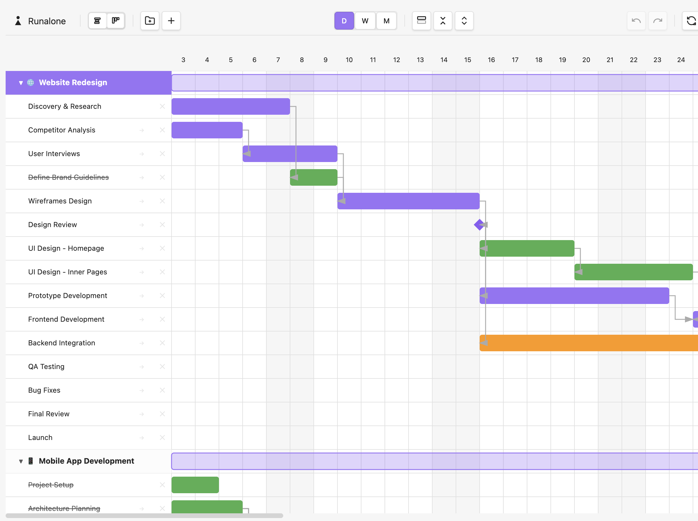
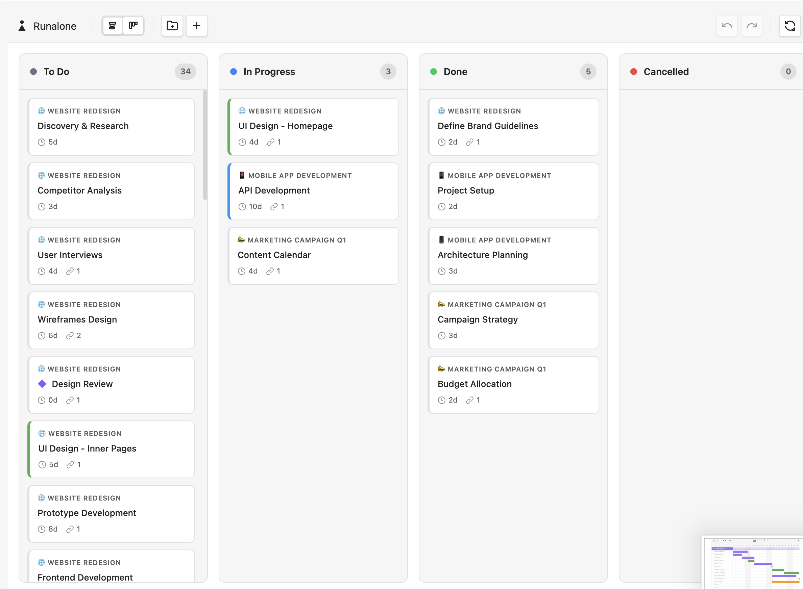
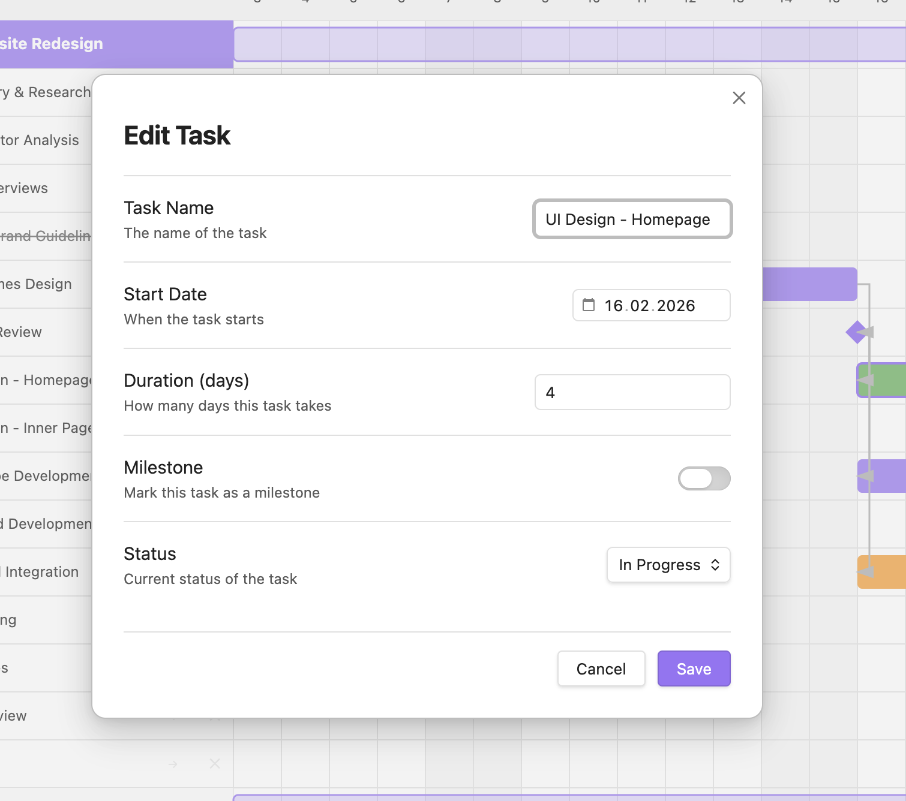

# Runalone Project Manager

A minimalist project management plugin for Obsidian, designed for solo developers, makers, inventors, and independent creators.

## The Problem

The market is flooded with project management tools—most of them cloud-based, subscription-driven, and built for large teams. While they promise productivity, they often deliver the opposite: complexity, distractions, and bloated workflows that don't fit the way independent creators actually work.

If you're a solo developer, maker, or innovator, your needs are different. You need something **simple**, **linear**, and **focused**—a tool that helps you manage time and projects without unnecessary overhead, accounts, or external dependencies.

For those who use Obsidian as their central hub for thinking and organizing, the lack of a native, integrated project management solution has always been a limitation.

And if you're someone who juggles many tasks at once—especially if you deal with ADHD or have a highly technical mindset—scattered task management can quickly lead to cognitive overload.

## The Solution

**Runalone Projects** was born from this personal need: a project management plugin built specifically for individuals, fully integrated into your Obsidian vault.

No cloud. No accounts. No external services. Everything stays local, in plain text files you control.

The plugin combines the essential features of **Kanban** with a lightweight, intuitive **Gantt Chart**, giving you both an operational and temporal view of your work. Plan tasks, visualize dependencies, and distribute your workload over time—all in a clear, ordered, and coherent way.

The goal is simple: **reduce chaos, increase clarity**, and let you focus on what truly matters—moving your projects forward in a sustainable and productive way.

  

## Features

- **Interactive Gantt Timeline** — Drag and drop to reschedule tasks, resize to change duration
- **Kanban Board View** — Switch between timeline and board view with one click
- **Plain Text Storage** — All data stored in readable Markdown files in your vault
- **Project Organization** — Group tasks into projects with custom icons
- **Task Hierarchy** — Support for nested subtasks (up to 3 levels)
- **Task Dependencies** — Define task sequences with `@after` syntax
- **Status Tracking** — Pending, In Progress, Done, Cancelled
- **Milestones** — Mark key dates and deliverables
- **Today Indicator** — Always know where you are in your timeline
- **Zoom Levels** — Day, Week, and Month views
- **Linked Notes** — Connect projects to Obsidian notes for detailed documentation
- **Drag & Drop Reordering** — Reorganize tasks and projects visually
- **Keyboard Shortcuts** — Undo/Redo support (Ctrl/Cmd+Z)
- **Fully Offline** — No internet connection required

## Installation

### From Obsidian Community Plugins

1. Open Obsidian Settings
2. Navigate to **Community Plugins**
3. Click **Browse** and search for "Runalone Projects"
4. Click **Install**, then **Enable**

### Manual Installation

1. Download the latest release from GitHub
2. Extract the files to your vault's `.obsidian/plugins/runalone-projects/` folder
3. Reload Obsidian
4. Enable the plugin in Settings → Community Plugins

## Quick Start

1. After enabling the plugin, click the **Runalone** icon in the left ribbon
2. The plugin will create a default `projects.md` file in your vault
3. Start adding projects and tasks using the toolbar buttons
4. Click on task bars to edit details, drag to reschedule

### File Syntax

Projects are stored in a simple, human-readable format:

```markdown
# My Projects
@start: 2025-01-01

## Project Name
> Task one (5)
> Task two (3) @after:1
>> Subtask (2)
> Final review (1) @after:2 @milestone
```

**Syntax Reference:**
- `## Project Name` — Creates a new project (add emoji for icon: `## 🚀 Project`)
- `> Task (duration)` — Task with duration in days
- `>> Subtask` — Nested task (use more `>` for deeper nesting)
- `@after:N` — Task depends on task number N
- `@start:YYYY-MM-DD` — Explicit start date
- `@milestone` — Mark as milestone
- `@done` — Mark as completed
- `@progress` — Mark as in progress
- `@cancelled` — Mark as cancelled
- `@note:NoteName` — Link to an Obsidian note (projects only)

## Settings

- **Projects File Path** — Location of your projects file
- **Default Zoom Level** — Initial timeline zoom (Day/Week/Month)
- **Auto Refresh** — Automatically reload when file changes
- **Row Height** — Adjust the height of task rows
- **Task Bar Height** — Adjust the height of task bars
- **Show Drag Handles** — Toggle visibility of reorder handles

## Philosophy

This plugin embraces a core principle: **simplicity over features**.

Not every project needs a complex system. Sometimes all you need is a clear view of what needs to be done and when. Runalone Projects gives you exactly that—nothing more, nothing less.

It's built for people who:
- Work independently or on small personal projects
- Value local-first, privacy-respecting tools
- Want project management that fits into their existing Obsidian workflow
- Need clarity without cognitive overhead

## Support

If you find this plugin useful and want to support its development:

- Star the repository on GitHub
- Report bugs and suggest features via GitHub Issues
- Share it with other solo creators who might benefit

## License

This project is licensed under the **GNU General Public License v3.0 (GPL-3.0)** with a **non-commercial clause**.

You are free to use, modify, and distribute this software for personal and non-commercial purposes. Commercial use requires explicit permission from the author.

See the [LICENSE](LICENSE) file for details.

## Author

**nestedshell**

---

*Built with focus, for those who build alone.*
